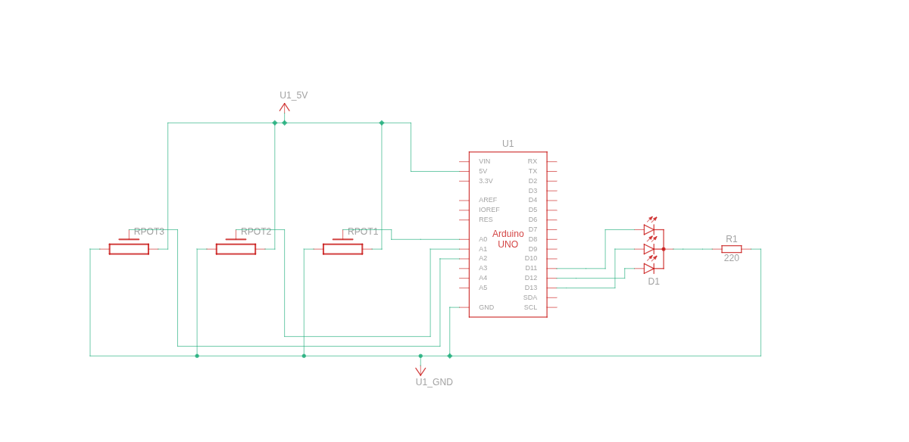
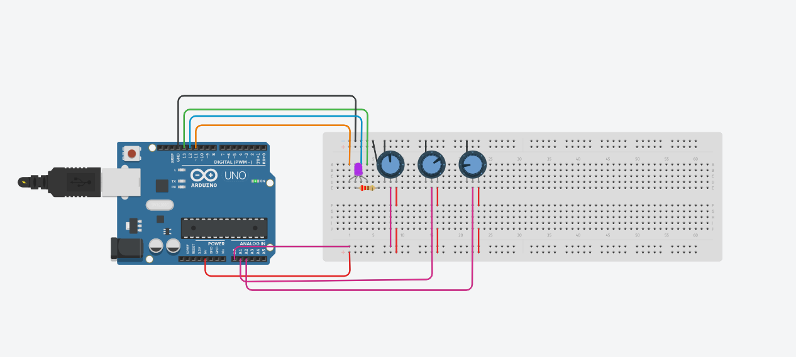

# DIY Potentiometer RGB LED Controller
A manual RGB color mixing system using three potentiometers and an Arduino. Control Red, Green, and Blue channels independently to create custom colors using PWM.

## Features
- Real-time RGB color mixing with three independent potentiometers
- PWM-based dimming for smooth color transitions
- Simple and affordable DIY electronics project
- Beginner-friendly Arduino setup

## Components Required
- Arduino Uno (or compatible)
- 3 × 0Ω Potentiometers
- 1 × RGB Common Cathode LED
- 3 × 220Ω Resistors
- Breadboard and jumper wires

## Circuit Diagram

## How It Works
Each potentiometer controls one color channel (Red, Green, Blue). The Arduino reads analog inputs (0-1023) and maps them to PWM output values (0-255) to control LED brightness.

## Installation & Setup
[Include setup instructions, wiring guide, and any calibration steps]

## Usage
Rotate each potentiometer to adjust the corresponding color intensity and create your desired color.

